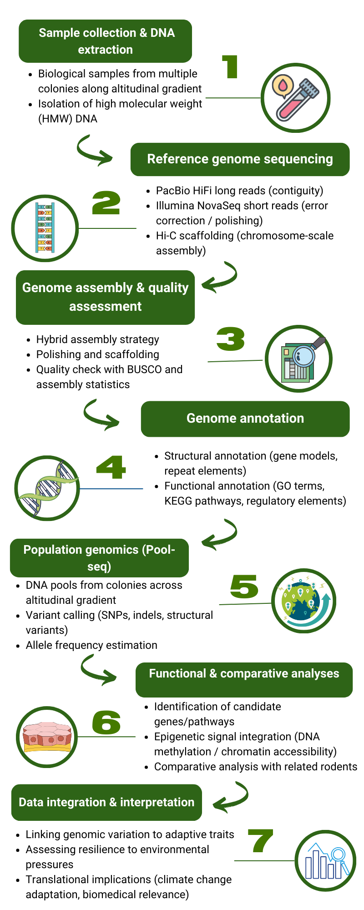

# Reference Genome Assembly of *Marmota marmota*  
*Applied Genomics 2025 – University of Bologna*  

  
  
  
  
  

## Table of Contents
- [Repository Structure](#repository-structure)  
- [Introduction](#introduction)  
- [Aim of the Project](#aim-of-the-project)  
- [Material and Methods](#material-and-methods)  
- [Estimated Cost](#estimated-cost)  
- [Results](#results)  
- [Discussion](#discussion)  
- [Conclusion](#conclusion)  
- [References](#references)  
- [Author](#author)  

## Repository Structure
The repository is organized into two main sections:

- **`project/`** → contains the Applied Genomics final project:  
  - **REPORT_AG_NATALE_SOFIA.pdf** (full report)
  - **Presentation slides** (PowerPoint)  

- **`teaching-materials/`** → lecture notes, transcripts, and study resources from the Applied Genomics course.  

## Introduction
The Alpine marmot (*Marmota marmota*) is an alpine rodent adapted to **chronic hypoxia** at high altitude and to **prolonged hibernation** with strong metabolic suppression.  
Its dual lifestyle makes it an ideal model to study how vertebrate genomes regulate **energy balance, stress resistance, and circannual physiology**.  
A reference genome is crucial to integrate population-level and functional genomic data, with implications for both **evolutionary biology** and **conservation**.

## Aim of the Project
To generate a **chromosome-scale reference genome** of *M. marmota* using a hybrid sequencing strategy (PacBio HiFi, Illumina, Hi-C), and to integrate it with:  
- **Population genomics** across an altitudinal gradient,  
- **Functional assays** (RNA-seq, ATAC-seq, ChIP-seq, WGBS),  
- **Comparative genomics** to detect conserved vs. marmot-specific adaptations.  

## Material and Methods
- **Sample collection**: Active and hibernating marmots sampled in the Stelvio National Park.  
- **Genome sequencing**: PacBio HiFi long reads, Illumina NovaSeq short reads, Hi-C scaffolding.  
- **Assembly & annotation**: Hifiasm, Pilon, AUGUSTUS, RepeatMasker, BUSCO.  
- **Population genomics**: Pool-seq (80 pools from 10 populations), BWA-MEM, bcftools, π, θ, F_ST, Tajima’s D.  
- **Functional assays**:  
  - RNA-seq (STAR, DESeq2, GO/KEGG enrichment),  
  - ATAC-seq & H3K27ac ChIP-seq (chromatin accessibility & enhancers),  
  - WGBS (Bismark, methylKit) for DNA methylation.  
- **Comparative analyses**: Orthologous gene families, annotation (eggNOG), synteny (MCScanX), adaptive evolution (dN/dS).  

  

*Figure: Overview of the methodological pipeline from genome sequencing to integrative analyses.*

## Estimated Cost

| Category                     | Details                                               | Estimated Cost (€) |
|------------------------------|-------------------------------------------------------|--------------------|
| **Sample collection & DNA**  | Fieldwork & logistics, consumables, cold chain, permits | 53,000 |
| **Reference genome**         | PacBio HiFi, Illumina, Hi-C sequencing                | 30,000 |
| **Population genomics**      | Pool-seq (80 pools, libraries, sequencing)            | 20,000 |
| **Functional assays**        | RNA-seq (12,400), ATAC-seq (5,000), ChIP-seq (8,000), WGBS (15,000) | 40,400 |
| **Personnel**                | Technician (18 mo, 37,500), Postdoc (24 mo, 70,000)  | 107,500 |
| **HPC & Dissemination**      | Storage & computing (15,000), Open Access (8,000)    | 23,000 |
| **Total**                    |                                                       | **294,000** |

## Results
Expected outcomes:  
- A **high-quality reference genome** (scaffold N50 > 50 Mb, BUSCO >95%).  
- **Population variation**: reduced nucleotide diversity at altitude, high F_ST at candidate loci.  
- **Transcriptome profiling**: DEGs enriched in lipid metabolism, thermogenesis, circadian rhythm.  
- **Chromatin assays**: active enhancers and promoters with state-dependent activity.  
- **DNA methylation**: DMRs overlapping metabolic and hypoxia-related genes.  
- **Comparative genomics**: lineage-specific expansions and adaptive signatures in marmot-specific genes.

## Discussion
The integrative design combines **ecological realism** (altitude + hibernation) with **molecular resolution** (multi-omics + population genomics).  

**Strengths**:  
- Reference genome anchors all analyses.  
- Multi-omics validation ensures robust identification of adaptive loci.  
- Comparative framework distinguishes conserved vs. species-specific adaptations.  

**Limitations**:  
- Hybrid assemblies may miss complex regions.  
- Functional predictions need experimental validation.  
- Geographic scope limited to Stelvio National Park.

## Conclusion
This project establishes the Alpine marmot as a **reference model** for studying mammalian adaptation to **chronic hypoxia and prolonged hibernation**.  
It provides a transferable pipeline for non-model species, with applications in:  
- **Biomedical research** (metabolic suppression, ischemia tolerance),  
- **Conservation** (genomic markers of climate resilience).

> *This project establishes the Alpine marmot as a genomic reference model for adaptation studies, bridging ecology, evolution, and biomedicine.*

## References 
- Gossmann, T. I., & Ralser, M. (2020). *Marmota marmota.* *Trends in Genetics,* 36(5), 383–384. https://doi.org/10.1016/j.tig.2020.01.006  
- Ortmann, S., & Heldmaier, G. (2000). Regulation of body temperature and energy requirements of hibernating alpine marmots. *Am J Physiol Regul Integr Comp Physiol,* 278(3), R698–R704. https://doi.org/10.1152/ajpregu.2000.278.3.R698  
- Theodoridis, S., et al. (2020). Evolutionary history and past climate change shape genetic diversity in mammals. *Nature Communications,* 11, 2557. https://doi.org/10.1038/s41467-020-16449-5  
- Rhoads, A., & Au, K. F. (2015). PacBio sequencing and its applications. *Genomics, Proteomics & Bioinformatics,* 13(5), 278–289. https://doi.org/10.1016/j.gpb.2015.08.002  
- Modi, A., Vai, S., Caramelli, D., & Lari, M. (2021). The Illumina sequencing protocol and the NovaSeq 6000 system. *Methods Mol Biol,* 2242, 15–42. https://doi.org/10.1007/978-1-0716-1099-2_2  
- Seppey, M., Manni, M., & Zdobnov, E. M. (2019). BUSCO: assessing genome assembly and annotation completeness. *Methods Mol Biol,* 1962, 227–245. https://doi.org/10.1007/978-1-4939-9173-0_14  

## Author
**Sofia Natale**  
MSc in Bioinformatics – University of Bologna  
**Contact**: sofia.natale@studio.unibo.it
 
